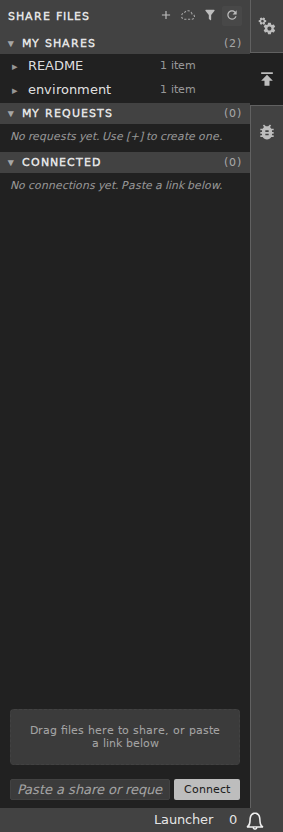
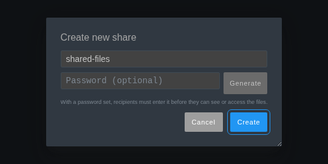
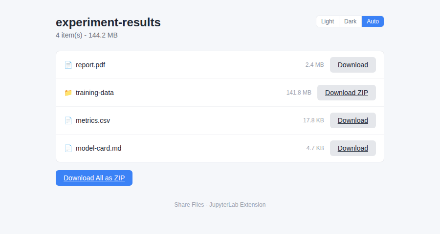
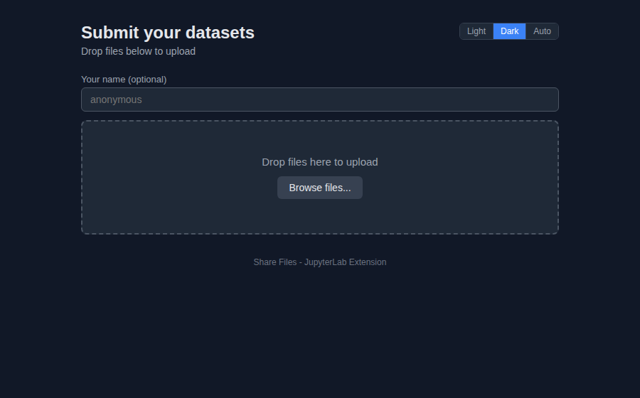
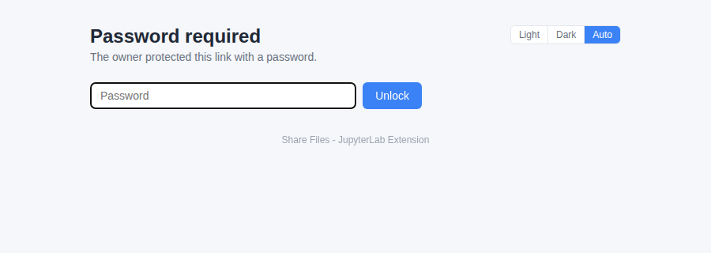
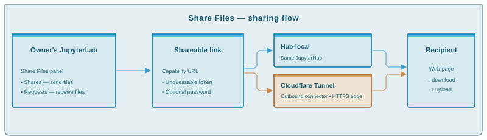

# jupyterlab_share_files_extension

[](https://github.com/stellarshenson/jupyterlab_share_files_extension/actions/workflows/build.yml)
[](https://www.npmjs.com/package/jupyterlab_share_files_extension)
[](https://pypi.org/project/jupyterlab-share-files-extension/)
[](https://pepy.tech/project/jupyterlab-share-files-extension)
[](https://jupyterlab.readthedocs.io/en/stable/)
[](https://kolomolo.com)
[](https://www.paypal.com/donate/?hosted_button_id=B4KPBJDLLXTSA)

Peer-to-peer file sharing for JupyterLab. Create a **share** (file drop) or **request** (inbox) from a side panel, copy the link - recipients open it in their own JupyterLab panel or any plain browser.

## Screenshots

The Share Files panel and the create-share dialog with optional password:

| Side panel                                            | New share with password                                         |
| ----------------------------------------------------- | --------------------------------------------------------------- |
|  |  |

The standalone page recipients see in any browser - download view, upload view (dark theme), password gate. System theme by default, Light / Dark / Auto switch:







## Features

- **Shares** - read-only drops of files and folders; recipients download
- **Requests** - inboxes; recipients upload, organised per uploader
- **Per-uploader identity** - request uploaders get a server-issued short hash in a browser cookie; the page shows only their own uploads with add/remove control; the owner panel shows `name (hash)` so several "anonymous" uploaders stay distinct
- **Connections** - paste someone's link to subscribe to their share or upload to their request
- **Drag-and-drop** from the file browser - drop zone (new share), share row (add files), request row (upload)
- **Browse inside a share** - double-click a folder to drill in; the `..` row goes back up
- **Open files directly** - double-click a file in the panel, JupyterLab opens it with the right viewer
- **Copy/paste** between the panel and the file browser
- **Right-click context menu** - file browser ("Share Files...") and panel rows ("Copy to Current Folder", "Show in File Browser")
- **Optional password protection** - set at creation or later (right-click → Set Password); recipients unlock before any access; one-click xkcdpass passphrase generation; link dialog shows the password with a copy button; attempts rate limited server-side
- **Hidden files visible by default** - dotfiles like `.env`, `.gitignore` are shareable; toggle in Settings
- **Standalone HTML page** - link works in any browser, no JupyterLab needed; Light / Dark / Auto theme
- **QR code** in the share-link dialog for scanning from a phone, plus a Copy button to grab the link again on demand
- **Live upload notifications** when someone uploads to your request
- **Self-connect guard** - pasting your own link shows a "you already own this" dialog
- **Symlink-friendly** - sharing `@shared/...` and similar works
- **Delete to trash** - panel deletes go to the OS trash by default (`c.ShareFilesConfig.use_trash`)
- **HTTPS-aware links** - share URLs follow the scheme the browser is on
- **Cloudflare tunnel sharing** - optional public links beyond your network; cloud icon in the panel header shows state, toggles public/private, opens setup when unconfigured ([docs/cloudflare_setup.md](docs/cloudflare_setup.md))
- **Settings toggles** - shares, requests, hidden-file visibility, poll interval



## Requirements

- JupyterLab >= 4.0.0
- Python >= 3.9

## Install

Developers (project `Makefile`):

```bash
make install
```

End-users (PyPI):

```bash
pip install jupyterlab_share_files_extension
```

## Configuration

Optional, in `jupyter_server_config.py`:

```python
c.ShareFilesConfig.shares_dir = "uploads"        # default - relative to the notebook root
c.ShareFilesConfig.use_trash = True              # default: True
c.ShareFilesConfig.verify_peer_tls = True        # default: True
c.ShareFilesConfig.password_max_attempts_per_minute = 30   # default: 30
c.ShareFilesConfig.password_attempt_cooldown_seconds = 1   # default: 1
```

- **`shares_dir`** - storage for shares/requests/connections; relative paths resolve against the notebook root, created on demand; must resolve **inside** the notebook root or the extension refuses to start with a `StorageError`
- **`use_trash`** - `False` deletes permanently instead of moving to the OS trash
- **`verify_peer_tls`** - set `False` for peers with self-signed certificates; otherwise server-side saves/uploads to them fail with a 502
- **`password_max_attempts_per_minute`** / **`password_attempt_cooldown_seconds`** - per-resource rate limiting of password attempts (`limits` library); generous defaults (30/minute, 1s); lower the cap or raise the cooldown to harden
- **`pollIntervalSeconds`** - panel refresh interval, Settings Editor → Share Files (default 15, minimum 2)
- **`tunnelAutostart`** - Settings Editor → Share Files (default off); bring the Cloudflare tunnel up at server startup - off, the server starts with private links and the cloud icon switches the tunnel on demand

## CLI

`jupyterlab_share_files` - the panel's operations as subcommands; a thin client over the same authenticated HTTP API, for scripts and AI agents. Human-readable output by default, `--json` for machine-readable.

- **`SHARE_FILES_BASE_URL`** - base URL of the Jupyter server; on JupyterHub this **must be the public user URL** (e.g. `https://hub.example.com/user/<name>/`) so links carry the public host; falls back to `JUPYTER_SERVER_URL`
- **`SHARE_FILES_TOKEN`** - Jupyter/JupyterHub API token; falls back to `JUPYTERHUB_API_TOKEN` / `JUPYTER_TOKEN`
- **`SHARE_FILES_INSECURE`** - `1` skips TLS verification (self-signed certificates); off by default

```bash
jupyterlab_share_files list-items
jupyterlab_share_files create-share <name> [paths...] [--password PW | --generate-password]
jupyterlab_share_files create-request <name> [--password PW | --generate-password]
jupyterlab_share_files add-files <share-id> <paths...>
jupyterlab_share_files remove-files <share-id> <names...>
jupyterlab_share_files remove-upload <request-id> <uploader-hash> <name>
jupyterlab_share_files set-password <share|request> <id> [PW] [--generate] [--clear]
jupyterlab_share_files generate-password
jupyterlab_share_files connect <link>
jupyterlab_share_files disconnect <key>
jupyterlab_share_files close-share <id>
jupyterlab_share_files close-request <id>
jupyterlab_share_files pick-up <key> [names...] [--target-dir DIR]
jupyterlab_share_files send-to-request <key> <paths...> [--uploader NAME]
jupyterlab_share_files list-request-uploads <id>
jupyterlab_share_files install-claude-skill
```

`install-claude-skill` installs the bundled Claude skill (a usage guide for this CLI) into `~/.claude/skills/jupyterlab_share_files/`, asking for confirmation before writing.

## Cloudflare tunnel sharing

The `cloudflare` command exposes share/request links beyond the hub or local network through a Cloudflare tunnel. Chosen for security: outbound-only connector (no inbound port), HTTPS enforced at the edge, and path-restricted ingress - only the extension's `/public/...` endpoints are routable; everything else answers 404 at the edge. Full guide: [docs/cloudflare_setup.md](docs/cloudflare_setup.md).

- **`setup --token <T> --account-id <A> --hostname <H> --private-base-url <URL>`** - save credentials (chmod-600 config) and provision end to end: create/reuse the tunnel (deterministic name `share-files-<sluggified private base URL>`), route the hostname, add a proxied CNAME, enforce HTTPS, save `public_base_url`, start the connector; `--private-base-url` is required and must be `https`
- **`validate`** - verify every component of the saved config: config completeness, URL sanity, token validity, tunnel existence/status/name on Cloudflare, proxied CNAME, ingress rule, `cloudflared` binary on PATH, daemon/toggle state
- **`info`** - current configuration; tokens masked to last 4 characters, `tunnel_active`, `daemon_running`, Cloudflare-side `tunnel_status`
- **`start`** / **`stop`** - switch between public links (daemon running) and private links; credentials, tunnel and DNS kept; effective on the next request, no restart
- **`reset`** - clear the saved token and derived state; links revert to the local/hub address; Cloudflare-side resources untouched
- **Connector supervision** - the extension keeps `cloudflared tunnel run` alive, retrying up to `c.ShareFilesConfig.cloudflared_retries` times (default 3); autostart is a user setting (default off)
- **Cloud icon** - panel header, always visible: green filled = tunnel on (public links), dim dashed = off/unconfigured (private links), blinking blue = connecting; click toggles, or opens the setup popup when unconfigured
- **Reachability check** - the link dialog probes the public link server-side (`api/link-check`; a frontend fetch would be blocked by CORS) and shows reachable/not reachable
- **Link rewrite** - the server reads `public_base_url` and the toggle per request and rewrites only scheme+host; the path stays auto-detected; without config, links keep the browser's host
- **Token policies required** - `Account → Cloudflare Tunnel → Edit` plus zone-scoped `DNS → Edit` for the hostname's domain

```bash
jupyterlab_share_files cloudflare setup --token <api-token> --account-id <account-id> \
  --hostname share.example.com --private-base-url "https://hub.example.com/user/<name>/"
jupyterlab_share_files cloudflare validate
jupyterlab_share_files cloudflare info
jupyterlab_share_files cloudflare start
jupyterlab_share_files cloudflare stop
jupyterlab_share_files cloudflare reset
```

## Security

- **The link is the credential** - 40 bits of entropy, no expiry; share over trusted channels
- **Optional password** as a second factor - unlock token bound to the password, so changing it instantly locks out everyone holding the old one
- **Brute-force protection** - per-resource rate limiting (`limits` library, in-memory): per-minute cap plus mandatory cooldown, both tunable (defaults 30/minute, 1s)
- **HTTPS** inherited from your JupyterHub/Jupyter proxy
- **Cloudflare exposure** is HTTPS-only and limited to the `/public/...` capability endpoints; the hub login, authenticated APIs and the private network stay unreachable
- **Connector token** passed via the `TUNNEL_TOKEN` environment variable, never on the command line - cannot leak through `ps`/`/proc`

## Releases

Versioned releases ship to [npm](https://www.npmjs.com/package/jupyterlab_share_files_extension) and [PyPI](https://pypi.org/project/jupyterlab-share-files-extension/) together, tagged `RELEASE_v<version>` on the [GitHub releases page](https://github.com/stellarshenson/jupyterlab_share_files_extension/releases). Full delivered feature list: [RELEASE.md](RELEASE.md); per-version changes: [CHANGELOG.md](CHANGELOG.md).

## Uninstall

```bash
pip uninstall jupyterlab_share_files_extension
```
