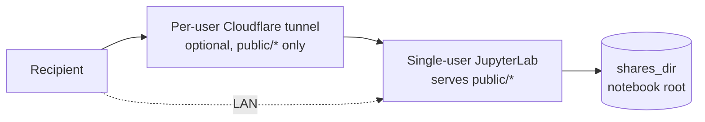
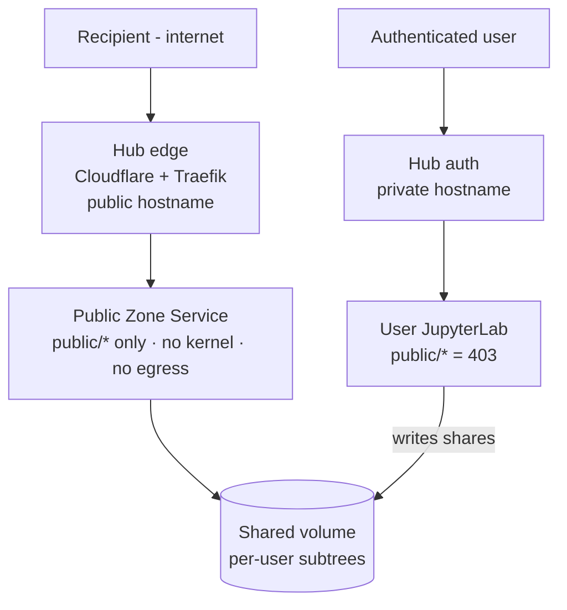

# Design - Hub-Managed Public Zone

High-level design for sharing work safely in two deployment shapes: a **standalone**
JupyterLab and a **JupyterHub** where all traffic flows through the hub. The goal in
hub mode is absolute: unauthenticated internet traffic never reaches any JupyterLab
server. This document is the design overview; the acceptance-criteria document is
derived from it.

## Problem

The `public/*` endpoints are unauthenticated by design - the link is the credential.
That is safe on a standalone box the operator owns, but dangerous under a hub.

- **No auth on the proxy path** - JupyterHub's proxy forwards `/user/<name>/*` to the single-user server with no authentication; auth is per-handler and `_PublicBase` opts out, so a recipient hitting `/user/<name>/.../public/...` lands **inside the user's JupyterLab server**
- **Per-user tunnel is a foot-gun** - if a user provisions the Cloudflare tunnel, their own lab container becomes internet-facing
- **Blast radius is the whole lab** - one badly-designed or compromised user server, once internet-reachable, is a DDoS source and a pivot into `jupyterhub_network`, where every user container is reachable by name
- **JupyterLab is the attack surface** - any JupyterLab vulnerability becomes internet-exploitable the moment the server is exposed

## Goal

A defensible design where sharing works in both modes and the internet-facing
surface in hub mode is one small, single-purpose service - not a JupyterLab.

- **Standalone** - unchanged; the operator owns the box and accepts the exposure
- **Hub-managed** - a dedicated Public Zone Service is the only thing serving `public/*`; user-server `public/*` returns 403; Cloudflare is global at the hub edge, never per-user
- **Invariant** - in hub mode no unauthenticated request ever reaches a JupyterLab server

## Two modes

The extension behaves differently depending on a single spawn-injected mode flag;
standalone is the default and is untouched.

- **Standalone** - single-user server serves `public/*` from a notebook-root `shares_dir`; optional per-user Cloudflare tunnel, path-restricted to `public/*`; "the link is the credential" plus an optional password
- **Hub-managed** - the Public Zone Service serves `public/*` from a shared volume; user servers only **write** shares into that volume over the internal network; the per-user tunnel is disabled; one hub-owned tunnel terminates at the zone

_Standalone: the operator owns the whole box; exposure is their explicit choice._

_Hub-managed: the internet reaches only the zone service; JupyterLab sits behind
hub auth and is never internet-reachable._

## Public Zone Service

A minimal Tornado application that reuses the extension's public handlers and the
on-disk storage contract - and nothing else. It is the entire internet-facing
surface in hub mode.

- **Reused** - the `_PublicBase` handlers (`routes.py:184`) and the read/upload functions in `storage.py`; the on-disk layout is a pure contract, so the same code serves the same files
- **Excluded** - no `ServerApp`, no kernels, no terminals, no contents API, no peer-fetch, no outbound network; it cannot execute code or read anything outside the shared volume
- **Topology** - its own hardened container on `jupyterhub_network`, behind Traefik on a **separate public hostname**, mounting only the shared share-files volume
- **Blast radius** - a read-mostly file server over one volume; a JupyterLab vulnerability is irrelevant because JupyterLab is not on the public path

## Shared volume

Shares move from user servers to the zone through a shared volume the hub already
provides, with one per-user subtree each.

- **Volume** - reuse `jupyterhub_shared` (mounted in every user container at `/mnt/shared`, `jupyterhub_config.py:140-144`) or a dedicated `jupyterhub_public_zone` volume
- **Layout** - `/<zone>/<username>/uploads/{shares,requests,...}` mirroring the current `shares_dir` tree: `shares/<slug>-<id>/`, `requests/<slug>-<id>/<uploader_hash>/`, `*.json` sidecars
- **Write path** - the user server's extension points `shares_dir` at its own subtree and writes authenticated over the internal network; the zone reads the same tree
- **Required change** - `resolve_shares_dir()` refuses paths outside the notebook root today (`storage.py:252-282`); hub mode must allow the configured volume subtree

## Cloudflare at the hub

One hub-admin-owned tunnel replaces every per-user tunnel, removing the foot-gun
that let any user expose their own lab.

- **Single tunnel** - hub-owned, terminating at the zone service, ingress path-restricted to `/public/*` on the public hostname; everything else answers 404 at the edge
- **Per-user disabled** - in hub mode the extension disables `cloudflare setup`; the cloud icon directs users to "sharing is managed by your hub"
- **No user-initiated exposure** - users can never punch an internet hole pointing at their own server

## Blocking unauthenticated traffic at the hub

Two independent controls keep the internet off JupyterLab; either alone is
sufficient, together they are defence in depth.

- **Edge** - the public hostname routes only `/<base>/public/*` to the zone; hub login, `/user/*` and `/hub/api/*` are not routes on that hostname and 404 at the edge; the authenticated hub lives on its own hostname and is never published publicly
- **Origin** - the extension detects hub-zone mode (spawn env var, e.g. `SHARE_FILES_PUBLIC_ZONE=hub`) and returns 403 for all `public/*` on the user server; the only working public path is through the zone

## Mode detection and tokens

One spawn-injected environment variable selects the mode; the recipient's security
model is unchanged, and any extra token guards only machine-to-machine paths.

- **Selector** - `SHARE_FILES_PUBLIC_ZONE=hub` injected at spawn for hub mode; absent means standalone (default, unchanged)
- **Recipient model** - still link plus optional password; no new credential is asked of recipients
- **Service token** - a hub-issued scoped token guards the write/callback path between user servers and the zone, never the recipient; follows the existing managed-service token pattern (`services.py`)

## User self-exposure

The lab is a research and development environment, so egress is **default-allow** -
users must reach arbitrary package indexes, dataset hosts, model hubs and APIs.
Egress is therefore a deterrent and a tripwire, not a guarantee; the containment of
the self-exposure threat rests on the public-zone, the removed one-click path, and
detection. A user with a shell can still expose their own lab regardless of sudo.

- **Default-allow, blocklist the known** - DNS and SNI category blocklists (HaGeZi proxy-bypass + DoH, UT1 `proxy`/`filehosting`) drop the named tunnel and cloud-exfil services; this stops casual and known use, the large majority of real cases
- **Sudo is the wrong lever** - `cloudflared` is a static binary a non-root user drops in `~/bin` and runs; `ngrok`, `frp`, `ssh -R`, or a hand-written socket relay are equivalent - stripping sudo stops none of them; blocklists match by hostname/SNI, so a raw-IP, encrypted-SNI, DoH or self-hosted relay slips past - the boundary fails open
- **Forced filtering DNS** - an internal resolver the containers must use, loaded with the categorized feeds; outbound 53/853 and known DoH endpoints redirected or denied so users cannot switch resolvers to escape it
- **Detection is the safety net** - an IDS (Suricata + ET Open) on the egress span alerts on tunnel/DoH attempts that get past the blocklist; in default-allow this catches what the filter cannot
- **Privilege caveat** - any of this holds only for containers that are **not privileged and have no docker socket**; the hub's per-group `docker_access` / `docker_privileged` grants are root-on-host and void it, so "trusted near the internet" and "gets docker/privileged" must be mutually exclusive groups
- **Sudo removal still earns its place** - as blast-radius reduction for a compromised container (no system tampering, no persistence), reliably enforced by the root entrypoint deleting `/etc/sudoers.d/*` on a per-group `ALLOW_SUDO=0` spawn flag before handing off to the user - just not as a tunnel control
- **Honest limit** - default-allow means self-exposure is deterred and detected, not prevented; the design accepts this trade for research freedom and leans on the public-zone so the _sanctioned_ sharing path never depends on it

## Adversarial vectors

Each attack vector against the public surface and the control that plugs it.

| Vector                                                                    | Control                                                                                                                                                                                                                                                                     |
| ------------------------------------------------------------------------- | --------------------------------------------------------------------------------------------------------------------------------------------------------------------------------------------------------------------------------------------------------------------------- |
| Internet → JupyterLab via the proxy path                                  | Edge routes only `public/*` → zone; user-server `public/*` returns 403                                                                                                                                                                                                      |
| User self-exposes their own lab (personal `cloudflared`/`ngrok`/`ssh -R`) | Default-allow egress (research lab): DNS/SNI category blocklist + forced filtering DNS + IDS detection - deters and detects, does **not** prevent; sudo removal does not stop it; privileged/docker-socket groups void it; containment rests on the public-zone, not egress |
| Compromised user server as DDoS source / pivot                            | User servers never internet-facing; zone has no outbound (egress dropped); network segmentation                                                                                                                                                                             |
| 40-bit share-id brute force                                               | Per-IP and global rate limiting on the zone - **a gap today; id guessing is unthrottled, only password unlock is limited**                                                                                                                                                  |
| Disk-fill via unauthenticated uploads                                     | Per-request quota, upload size cap, volume high-watermark on the zone                                                                                                                                                                                                       |
| Path traversal / cross-user read                                          | Id regex `[A-Z2-7]{6,16}`, resolve-inside-subtree, no contents API on the zone                                                                                                                                                                                              |
| Plaintext password readable by the zone                                   | Move to a hashed password with the unlock HMAC keyed on the hash, so the zone never holds the plaintext                                                                                                                                                                     |
| Shared volume as a new trust boundary                                     | Zone mounts read-only except upload dirs; per-user subtrees; volume holds only share data, never home or secrets                                                                                                                                                            |
| SSRF / open proxy through the zone                                        | Zone serves only static reads from the volume; no peer-fetch, no outbound                                                                                                                                                                                                   |
| Edge misconfig exposing the hub                                           | Separate public hostname, allow-list route, deny-by-default catch-all 404                                                                                                                                                                                                   |
| Capability-URL leak (logs, Referer, history)                              | Optional password second factor; residual - see below                                                                                                                                                                                                                       |

## Residual risks

Honest limitations the design does not remove.

- **Capability-URL leakage** - a leaked link grants access until the resource is closed; mitigated, not eliminated, by the optional password
- **No expiry or revocation** short of closing the share
- **Shared volume is a new trust boundary** - the zone and every user server touch it; its integrity is now part of the security model
- **Rate-limit state is per process** - in-memory counters are more lenient across multiple workers, never less safe
- **Default-allow egress** - a deliberate trade for research freedom; self-exposure and exfiltration are deterred and detected, never fully prevented; the sanctioned sharing path is built not to depend on egress control

## Status

Design only. No implementation here - the zone service, the `resolve_shares_dir`
relaxation, password hashing, and zone rate limiting are sized in the acceptance-
criteria document that follows. Volume name, hostname scheme, and Traefik label
syntax are recommendations, finalised at implementation time.
