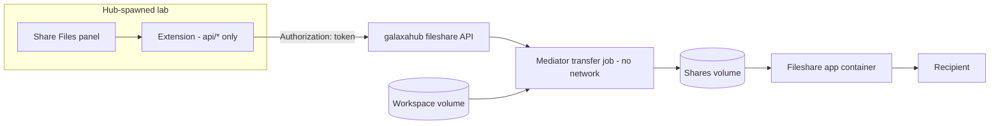

# Design - Hub Mode

The extension runs in one of two modes, decided once at server start. On a standalone JupyterLab it serves recipients itself from the notebook root. On a lab spawned by galaxahub it mounts no unauthenticated route at all and every panel action goes through the hub's fileshare API, which stages the bytes with its own transfer job and serves recipients from its own app container. The lab never holds a share byte and never carries a recipient request.

## Two modes

|                                              | Standalone                       | Hub                                                             |
| -------------------------------------------- | -------------------------------- | --------------------------------------------------------------- |
| Signal                                       | `SHARE_FILES_PUBLIC_ZONE` absent | `SHARE_FILES_PUBLIC_ZONE=hub`, injected by the hub at spawn     |
| Who can set it                               | nobody needs to                  | only the hub - the name is reserved against users and groups    |
| `api/*` routes (authenticated)               | local store                      | proxied to the hub                                              |
| `public/*` and `static/*` routes             | mounted                          | not mounted - jupyter_server answers 404                        |
| Store directory                              | created on first use             | never created                                                   |
| Per-user Cloudflare tunnel                   | optional                         | never started; the tunnel is the hub's                          |
| Peer connections                             | yes                              | no                                                              |
| Fallback when the hub contract is incomplete | n/a                              | none - stays in hub mode, hub calls fail with `hub_unavailable` |

The mode decision depends on the spawn variable alone. A missing API path or token never remounts the standalone routes - that would be the exact bypass hub mode exists to close.

## The spawn contract

galaxahub injects three things into every lab it manages; the extension reads them once.

- **`SHARE_FILES_PUBLIC_ZONE=hub`** - selects hub mode (`hub.hub_mode()`)
- **`SHARE_FILES_HUB_API`** - the path of the hub's fileshare API (`/hub/api/fileshare`); joined with the scheme and host of `JUPYTERHUB_API_URL`; an absolute value is used verbatim (`hub.hub_api_base()`)
- **`JUPYTERHUB_API_TOKEN`** - the lab's own token; every hub request carries `Authorization: token <it>`, set in one place (`hub.HubClient.request`)
- **Hub side** - the fileshare handlers accept token authentication (`_accept_token_auth = True`, galaxahub v4.4.56); a call without a token answers 403

## What the lab mounts in hub mode

`routes.setup_route_handlers` builds one of two tables and never mixes them. The hub table (`hub_routes.hub_handlers`) holds only `APIHandler` subclasses, every method wrapped by `tornado.web.authenticated`.

| Panel call                                   | Hub call                                                                                    | Notes                                                                                    |
| -------------------------------------------- | ------------------------------------------------------------------------------------------- | ---------------------------------------------------------------------------------------- |
| `GET api/info`                               | `GET capabilities`                                                                          | `mode: hub`, grants, refusal reason, serving verdict, password requirement, toggle state |
| `GET api/stream`                             | `GET stream`                                                                                | the change stream, one hub connection per lab (below)                                    |
| `GET api/tunnel`, `POST api/tunnel`          | `GET capabilities`, `GET items`, `PUT <kind>/<id>/cloud` per record                         | the cloud toggle - flips every record and the default; a switch on starts the wait       |
| `POST api/<kind>/<id>/cloud`                 | `PUT <kind>/<id>/cloud {cloud}`, then `GET items` after a switch on                         | one record's Cloudflare switch                                                           |
| `GET api/link-check`                         | `GET items`, then a GET of the record's `url` from the lab server                           | reachable = the link answered 200; no redirect followed                                  |
| `GET api/shares`                             | `GET items`                                                                                 | hub rows of kind share                                                                   |
| `POST api/shares`                            | `POST shares {title, paths, password}`, then `PUT shares/<id>/cloud` while the toggle is on | paths only, never bytes; 202 becomes a `staging` row                                     |
| `GET/DELETE api/shares/<id>`                 | `GET items` / `DELETE shares/<id>`                                                          | 204 removes the record and the bytes                                                     |
| `GET api/requests`                           | `GET items` + `GET requests/<id>/uploads`                                                   | one uploader group per request                                                           |
| `POST api/requests`                          | `POST requests {title, password}`, then the same cloud switch                               | 201 `ready`                                                                              |
| `GET/DELETE api/requests/<id>`               | `GET items` / `DELETE requests/<id>`                                                        |                                                                                          |
| `GET/POST api/<kind>/<id>/password`          | `PUT <kind>/<id>/password`                                                                  | the value read back is the one set in this server process                                |
| `POST api/requests/<id>/uploads/<uid>/fetch` | `POST .../fetch {dest}`                                                                     | the lab picks a fresh directory under the folder the panel names                         |
| `GET api/generate-password`                  | none                                                                                        | local                                                                                    |

Not mounted, because the hub has no equivalent: adding or removing files on an existing share (a hub share is a snapshot), removing a single upload, peer connections, tunnel setup and reset.

## Links and the cloud toggle

Every hub record carries its own Cloudflare switch (`cloud`, galaxahub ACC-FILE-2920): off, the record serves on the hub's own address alone; on, the hub composes its link on the tunnel hostname once its tunnel reports registered and a tunnel hostname exists, and on its own address before that; `capabilities.public_base_url` is always the hub's own address (galaxahub v4.4.58) and confirms nothing. The hub mints every record with the switch off, and the tunnel runs only while some record has it on. The lab never composes a link; it restores the address recipients can use.

- **Hub's own address** - the hub composes a row's `url` from the Host header of the request it answers, so a lab-originated call yields the hub's internal address; an origin equal to the hub API origin is replaced by the origin the browser reached the lab on (forwarded headers, else the request host) plus the hub path `/s/<id>`
- **Tunnel address** - any other origin is the hub's choice for a record switched on and is kept as composed
- **Per-record switch** - `POST api/<kind>/<id>/cloud {cloud}` relays `PUT <kind>/<id>/cloud`; the row carries `cloud`, the panel offers "Share Through Cloudflare" / "Hub Network Only" in the row's context menu and the link dialog says when a record's link works on the hub network only; rows carry no cloud mark - the header icon alone shows whether Cloudflare is on
- **Toggle** - the header cloud icon is the bulk switch: `POST api/tunnel {active}` flips every record of the user through the hub and stores the default for the next one in the CLI config file (`hub_cloud`, default off); a record created while the toggle is on is switched on right after the hub minted it and answers with the url the hub composed for it
- **Refusal** - the hub refuses a switch on with `cloud_not_configured` while the owner's group policy has Cloudflare off; the toggle relays the 403 and stays off unless it switched a record before the refusal (Confirmation wait), a create leaves the row off, turns the toggle off and carries `cloud_reason` so the panel says why the link stayed on the hub network; the panel shows every refusal as a warning in `hubReasonText` words; a switch off is never refused
- **Confirmation wait** - the tunnel registers some seconds after the first record is switched on, and the hub does not ring the change stream when it does, so the lab waits for it (`hub_routes.CloudWait`, one per lab server process). A switch on - `POST api/tunnel {active: true}` that switched a record, `POST api/<kind>/<id>/cloud {cloud: true}`, or a create that applied the default - reads the items once; a record whose `url` already carries an origin other than the hub API origin needs nothing, the rest start the wait or join the one running. `POST api/tunnel {active: true}` also waits for a record already on whose `url` is the hub's own, and one that fails partway stores the default on and waits for the records it switched before it relays the failure, so no record is left on while the header reads off. While waiting the lab reads `GET items` at most every 5s (`CONFIRM_POLL_SECONDS`) for at most 120s (`CONFIRM_TIMEOUT_SECONDS`, overridden by `SHARE_FILES_CLOUD_CONFIRM_SECONDS`); with nothing waiting it reads nothing
- **Confirmed** - every record switched on during the wait carries a `url` off the hub API origin, or was switched off or removed: the wait ends and the lab rings every open panel once (below)
- **Not confirmed** - at the bound the lab puts `cloud: false` on the records still unconfirmed, stores the default off, keeps the reason `cloud_not_confirmed` and rings the panels; the panel that sees the wait end with that reason warns that the hub did not bring up its Cloudflare address and links stay on the hub network. A switch back off that fails leaves the default as it is and keeps the reason `hub_unavailable` when the hub did not answer, which the panel shows as "The hub could not be reached.", or `cloud_not_switched_off` when it answered other than 204 or 404, shown as "The hub did not switch Cloudflare off." The next switch on clears the reason; a switch off ends the wait at once for the records it switched
- **No record** - `POST api/tunnel {active: true}` with nothing to switch stores the default alone and answers `tunnel_waiting: false`; the next record switched on starts the wait
- **State** - `api/tunnel` and `api/info` report `tunnel_configured` (true while the hub answers - the hub decides per record), `tunnel_active` (the stored default), `tunnel_running` (the hub's cached serving verdict), `tunnel_waiting` (a switch on waits for the confirmation) and `tunnel_reason` (`cloud_not_confirmed` after a timeout, `hub_unavailable` or `cloud_not_switched_off` after a timeout whose switch back off failed, '' otherwise). The wait lives in the lab, so a panel opened or reloaded during it reads it too
- **Header icon** - four looks, each with a tooltip of two lines at most: on (green cloud), off (dashed silhouette), waiting (the blinking blue cloud, static and half transparent under `prefers-reduced-motion`) from a click on it or a row's switch on until the wait ends and while a switch off is in flight, and hub unavailable (a struck-through cloud in the warning colour). After a switch on the hub never confirmed the icon shows off with the `tunnel_reason` sentence in the tooltip's second line until the next switch on; after a switch back off that failed - the hub kept the records on - the icon keeps the on look, because it never claims off while the hub holds the records on. `aria-pressed` is true while on and while a switch on is in flight or waits; a click switches off while it is true - during the wait it ends the wait - and on otherwise; a click never shows on before the confirmation
- **Link check** - `GET api/link-check` finds the record in `GET items` and opens its `url` from the lab server with the standalone probe (`routes.probe_link`: 10s timeout, no redirect followed, certificate not verified): the tunnel hostname through Cloudflare. The dialog asks only for a tunnel link: a link on the browser's own origin is the hub's own address, which the lab cannot open (the hub API port answers `/s/<id>` with a 302 to `/hub/s/<id>`), so the dialog says it works on the hub's network only, or, for a record switched on while the wait runs, that it moves to the Cloudflare hostname once the hub confirms, and does not probe it. `reachable` is true only for a 200; a failure answers the `status` or an `error` (`no answer within 10 s`, `connection refused`, `no address for the host name`, `a TLS error`, `a closed connection`, `a network error`), and the dialog says what answered and names the address opened only when it differs from the link it shows. `capabilities.serving` plays no part - it is cached on a 30s tick and reads false on a fresh deployment while the link already works. A GET of the recipient page renders it and changes nothing (galaxahub fileshare `app.share_page`: no view count, no event, no download, no password attempt); it charges one token of the page's per-address lookup rate limit, as any recipient's GET does. Each opening of the dialog checks again

## Change stream

The hub tells a lab when any of its records changed (galaxahub ACC-FILE-2919); the panel fetches on a ring instead of on a timer, so a lab costs the hub nothing while nothing changes.

- **One hub connection per lab** - `hub_stream.RELAY` opens `GET stream` on the hub when the first panel subscribes and closes it when the last one leaves; every ring is fanned out to every open panel stream as one `changed` event, and the open itself rings so a reconnect refetches
- **Raw socket, not the tornado client** - a tornado fetch cannot be cancelled and the hub never ends the stream, so a stream the last panel left behind would hold a slot of the shared client until the hub died; the relay speaks HTTP/1.1 over an asyncio socket, de-chunks the body and closes the socket on cancel. A read that waits longer than three hub keepalives (90s) is a vanished hub and reconnects
- **Panel stream** - `GET api/stream` (authenticated, Server-Sent Events): `retry: 5000` on open, `event: changed` per ring, a keepalive comment every 25s while idle, `event: poll` when the hub has no stream route; the handler ends when the browser hangs up
- **Panel** - one `EventSource` per attached panel in hub mode; the timer is stopped while it stands. A ring schedules one fetch after 300ms so a burst costs one; the open and every reconnect fetch too, so a ring lost while disconnected is covered. `poll` puts the panel back on its timer for the session; a source the browser closed for good (a non-200 answer while the lab restarts behind the proxy) puts it on the timer until the next refresh reopens the stream
- **Older hub** - a hub without the route answers 404 once per subscription cycle: the relay remembers the verdict while a panel listens and asks again when a fresh panel subscribes; a hub that cannot be reached, or answers a status line with no code, is retried every 5s while a panel listens
- **The lab's own ring** - the hub rings when a record changes or its serving verdict flips, not when its tunnel registers; when the confirmation wait ends the lab rings `hub_stream.RELAY` itself, so every open panel fetches once and shows the tunnel links without Refresh. A panel on its timer picks the change up on its next tick; no panel polls for the end of the wait
- **Standalone** - unchanged: the timer, whose interval setting now says it is the standalone and fallback cadence

## Password policy

A group may require a password on every record (galaxahub ACC-FILE-2927); `capabilities.password_required` rides on `api/info` as `hub.password_required`.

- **Create dialog** - the password field is required and starts with a generated passphrase; an emptied field keeps Create disabled, so no create reaches the hub without one
- **Change dialog** - the password field is required, the hint names the rule and offers no removal; an empty field keeps Save disabled, including one the dialog opened empty
- **Relay** - the hub's 400 `password_required` on a create or a password removal is relayed with its reason, which the panel names

## Errors

The hub refuses with `{reason, message}` from a closed slug set; the lab relays the status and the slug.

- **403, 400, 404, 429, 503** - status and message kept, `reason` added when the hub named one
- **Hub unreachable** - 502 with `reason: hub_unavailable`; `api/info` still answers 200 with `hub.available: false` so the panel keeps its last view
- **Panel** - `hubReasonText` turns a slug into a sentence, including `password_required`, `cloud_not_configured`, `policy_conflict` and the lab's own `cloud_not_confirmed`, `cloud_not_switched_off` and `cloud_not_switched_on`; the slug rides on the thrown error as `reason`; the New menu greys out a refused kind with the reason; a refused share row shows the sentence on one line, with the slug in its hover
- **Outage on Refresh** - a Refresh the user clicked that fails with `hub_unavailable` shows one warning and the icon's hub-unavailable look; a background refresh only updates the icon

## Enforcement

The invariants are pinned by tests, not by review.

- **Route table** - hub mode registers no pattern under `public/` or `static/`, no `_PublicBase` or `StaticFileHandler`; every method the extension implements on a registered handler carries `authenticated` (`tests/test_hub_mode.py`)
- **Fail closed** - hub mode with the token or the API path missing still mounts no public route (`tests/test_hub_mode.py`)
- **Handlers** - driven through a live jupyter_server against an in-memory hub: shapes, refusal relay, links, the toggle and the per-record switch, the confirmation wait (one ring on confirmation, bounded item reads and none while idle, one wait for two switch-ons, the timeout revert and its reason, no wait for a confirmed link or without a record), the link check against a loopback recipient page, the password requirement, fetch, the panel stream (`tests/test_hub_handlers.py`)
- **Stream** - the relay's lifecycle against a scripted hub and the raw read against an in-process SSE server, including that a cancel closes the socket, that a 404 leaves the relay not connected and that a malformed status line is retried (`tests/test_hub_mode.py`)
- **End to end** - galata against a mock hub over HTTP: 404 on the recipient paths, panel state badges, grants, fetch, the link dialog reachable while the hub reports serving false and naming what answered when the page fails, the toggle and a row's own switch with no row mark, the pulse until the tunnel registers and the tunnel link on a second open page without Refresh, the timeout warning and the off icon, the busy icon on a switch off, a policy refusal as a warning, two-line tooltips, the outage warning on a clicked Refresh, no timer while the stream stands and one fetch per ring, the timer fallback on an older hub, the required password (`ui-tests/tests/hub`, `ui-tests/mock_hub.py`); CI runs it beside the standalone suite
- **Standalone** - the 27-route table with its public and static routes, and every pre-existing test, unchanged

## Residual

- **Process restart** - passwords set through the panel are held in memory; after a restart the dialog shows the link without the value (the hub stores only a hash)
- **Mode is read from the environment** - a user with a shell cannot change it for the running process; a restart goes through the hub, which re-injects it. Persisting a modified extension across respawn is an image-integrity question, not this design's
- **Hub-side backstop** - the hub's proxy could refuse `jupyterlab-share-files-extension/public/*` for every user, not only download-blocked ones; that change belongs to galaxahub
